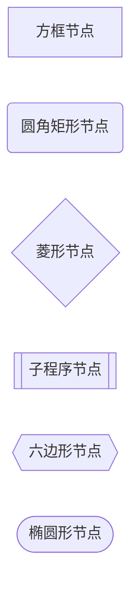
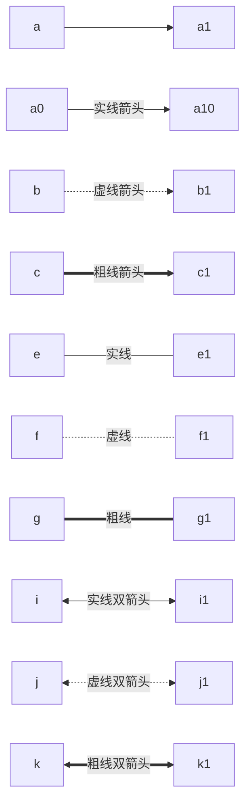
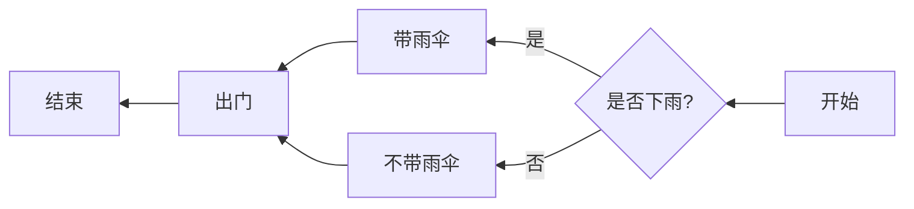
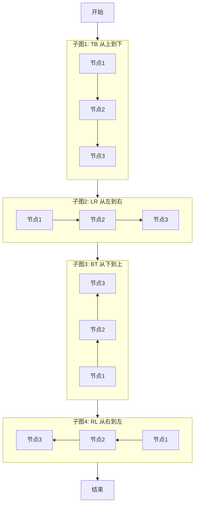

### 参考:https://mermaid.nodejs.cn/

```mermaid
graph LR
    %% 节点
    id0[方框节点]
    id1(圆角矩形节点)
    id2{菱形节点}
    id3[[子程序节点]]
    id4{{六边形节点}}
    id5([椭圆形节点])
```

***
***

```mermaid
graph LR
    a --> a1
    a0 -->|实线箭头| a10
    b -.->|虚线箭头| b1
    c ==>|粗线箭头| c1

    e ---|实线| e1
    f -.-|虚线| f1
    g ===|粗线| g1

    i <-->|实线双箭头| i1
    j <-.->|虚线双箭头| j1
    k <==>|粗线双箭头| k1
```    

***
***

```mermaid
%% demo
%% TB: 从上到下
%% BT: 从下到上
%% LR: 从左到右
%% RL: 从右到左
graph RL
    A[开始] --> B{是否下雨?}
    B -->|是| C[带雨伞]
    B -->|否| D[不带雨伞]
    C --> E[出门]
    D --> E
    E --> F[结束]
```

***
***

```mermaid
graph TB
    Start[开始] --> Sub1
    
    subgraph Sub1[子图1: TB 从上到下]
        direction TB
        A1[节点1] --> A2[节点2]
        A2 --> A3[节点3]
    end
    
    subgraph Sub2[子图2: LR 从左到右]
        direction LR
        B1[节点1] --> B2[节点2] --> B3[节点3]
    end
    
    subgraph Sub3[子图3: BT 从下到上]
        direction BT
        C1[节点1] --> C2[节点2]
        C2 --> C3[节点3]
    end
    
    subgraph Sub4[子图4: RL 从右到左]
        direction RL
        D1[节点1] --> D2[节点2] --> D3[节点3]
    end
    
    Sub1 --> Sub2
    Sub2 --> Sub3
    Sub3 --> Sub4
    Sub4 --> End[结束]
```